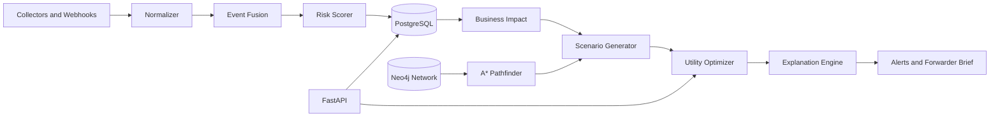

# Logistics Recovery Intelligence Engine

LRIE is a decision-first recovery engine for disrupted container shipments. It ingests disruption signals, scores shipment risk with a complete Bayesian CPT model, estimates no-action impact, searches counterfactual recovery paths, selects the best plan with multi-attribute utility, and emits an explainable trace.

## Run

```bash
docker compose up --build
```

The API is available at `http://localhost:8000`. Default development API key:

```text
X-API-Key: dev-secret
```

## Seed Neo4j

The API container runs `alembic upgrade head` and attempts `python -m app.cli seed-graph` during startup. You can rerun graph seeding manually with:

```bash
docker compose exec api python -m app.cli seed-graph
```

## API Examples

Upload shipments:

```bash
curl -H "X-API-Key: dev-secret" -F "file=@sample.csv" http://localhost:8000/shipments/upload
```

Inject a disruption:

```bash
curl -X POST http://localhost:8000/webhooks/disruption \
  -H "X-API-Key: dev-secret" -H "Content-Type: application/json" \
  -d '{"event_type":"severe_weather","source":"manual","confidence":0.85,"severity":0.7,"start_time":"2026-06-11T00:00:00Z","affected_ports":["NLRTM"],"affected_vessels":[],"raw_data":{}}'
```

Fetch recovery:

```bash
curl -H "X-API-Key: dev-secret" http://localhost:8000/shipments/{shipment_id}/recovery
```

Sample CSV:

```csv
origin_port_code,destination_port_code,cargo_value,etd,eta,vessel_name,carrier_name,forwarder_phone,forwarder_email
INNSA,NLRTM,10000000,2026-06-11T10:00:00Z,2026-06-16T10:00:00Z,TestVessel,Maersk,+15551234567,ops@example.com
```

## Architecture



## Tests

```bash
pytest
```
